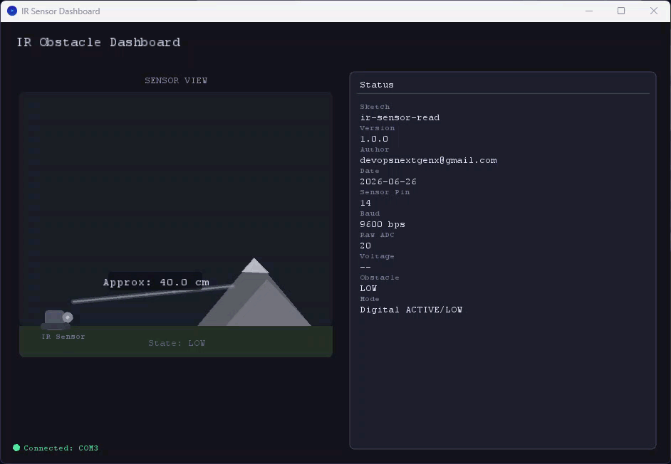

# IR Sensor Dashboard

This directory contains a Processing dashboard for real-time IR obstacle visualization, styled similarly to the `led-blink` dashboard.

## Files

- `dashboard.pde` - Main Processing dashboard sketch.

## What the Dashboard Shows

- Animated obstacle orb:
  - **ACTIVE** -> pulsing red animation.
  - **LOW** -> gray idle state.
- Approximate distance in cm (when analog data is available).
- Status panel fields:
  - Sketch
  - Version
  - Author
  - Date
  - Sensor Pin
  - Baud
  - Raw ADC
  - Voltage
  - Obstacle
  - Mode

## Firmware Serial Protocol

The `ir-sensor-read` firmware now emits:

- Metadata lines:
  - `Sketch: ...`
  - `Version: ...`
  - `Author: ...`
  - `Date: ...`
  - `Sensor Pin: ...`
- Analog telemetry line:
  - `Raw ADC: 512 | Voltage: 2.50 V`
- Explicit digital state line:
  - `Obstacle: ACTIVE`
  - `Obstacle: LOW`

## Run Steps

1. Install Processing from [processing.org](https://processing.org).
2. Upload and run `ir-sensor-read` on the Nano.
3. Open `ir_sensor_dashboard/ir_sensor_dashboard.pde` in Processing IDE.
4. Press Run.

By default, the first detected serial port is used. If needed, set a fixed COM port in `setup()`.

## Calibration Notes

Distance is a rough estimate for analog IR sensors and depends on module type, target surface, angle, and ambient light.

Tune these values in `dashboard.pde`:

- `ADC_NEAR`
- `ADC_FAR`
- `DIST_NEAR_CM`
- `DIST_FAR_CM`
- `OBSTACLE_THRESHOLD_ADC`

## Snapshots

- IR Sensor Read

  
  
For digital-only modules, use obstacle ACTIVE/LOW state only.

## References

- [Processing Reference](https://processing.org/reference/)
- [Processing Serial Library](https://processing.org/reference/libraries/serial/)
