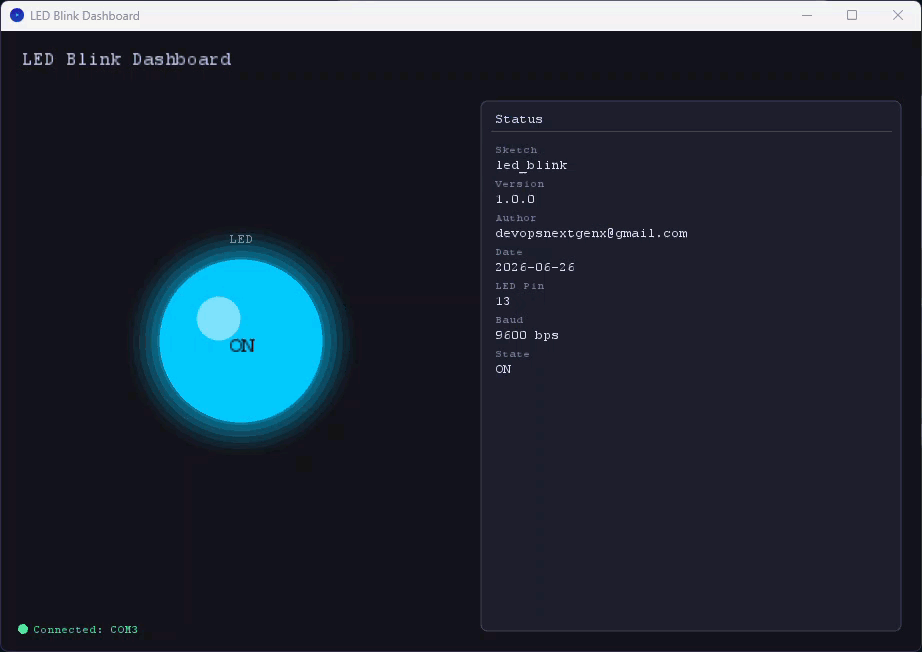
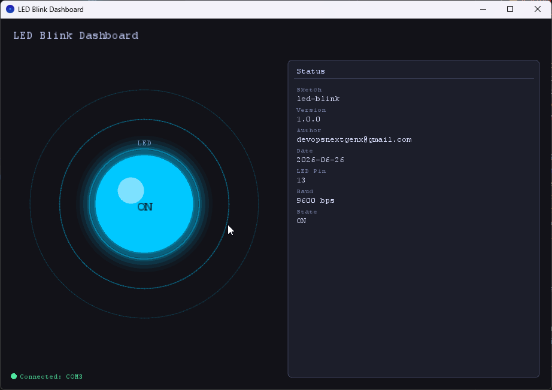
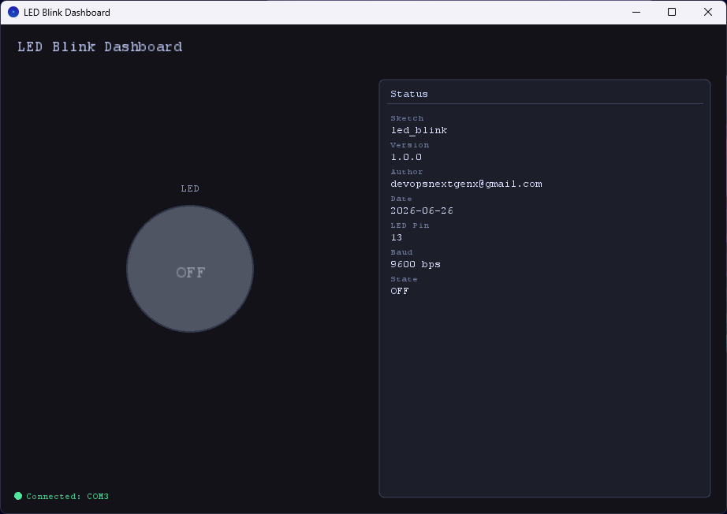

# Dashboard Directory

This directory contains Processing-based UI code for real-time visualization of the LED blink state.

## Overview

A Processing sketch can listen on the serial port and display the current LED state (ON/OFF) along with a live cycle timeline.

## Files

- `dashboard.pde` - Main Processing sketch (if created)
- `data/` - Assets (images, fonts, etc.) - optional

## Getting Started

1. **Install Processing:** Download from [processing.org](https://processing.org)

2. **Open `dashboard.pde` in the Processing IDE**

3. **Verify Serial Configuration:**
   - Check which COM port your device uses: `pio device list`
   - Update in `dashboard.pde`: `myPort = new Serial(this, "COM3", 9600);`

4. **Run the Dashboard** and observe the LED state toggle every 3s/2s.

## Serial Protocol

The Arduino sketch outputs plain-text lines:
```
LED ON
LED OFF
```
Parse these in Processing to drive the UI indicator.

## snapshots

- LED Dashboard

   

- LED ON
  
   

- LED OFF
  
   

